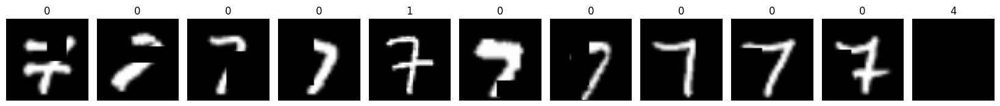
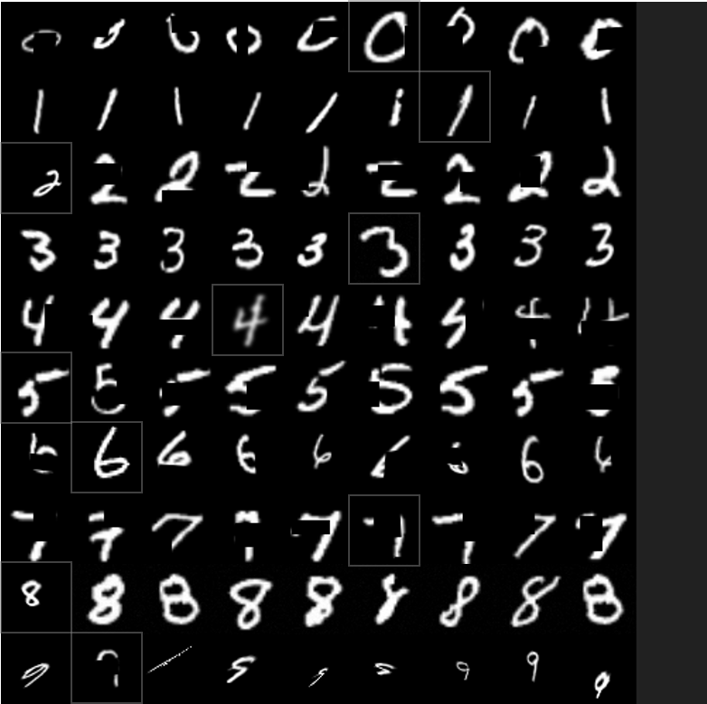

# RandomAnomaly
Random Anomaly dataset generation code for parquet files featured in sparse RNN research.  

The two primary data files compiled using this process (RandomAnomaly_Train_Combined30.parquet.gzip and RandomAnomaly_Train_Combined58.parquet.gzip) are too large to host here as they combine for 1.71GB but are available upon request.

An image example is shown in the repository, in each sequence each number represents a distinct image in a sequence of images.

**RandomAnomalyDatasetCreator.ipynb** is used to generate random anomaly datasets based off of the underlying MNIST dataset.
**CombineFiles.ipynb** is used to combine the generated files into a set of larger parquet files.

The dataset structure when read into Pandas includes a DataFrame with each row including a dictionary of length 2 with 'y' and 'x'. 
The 'y' entry of each dictionary is a numpy array of 11 ground truth values while the 'x' entry of each dictionary is a numpy array of 11 images.
The 'y' values of each numpy array are binary for the first 10 entries (1 represents the anomaly) and the last is the index location of the anomaly.
The 'x' values are 2500 dimension numpy arrays representing 50x50 images with the final image blank indicating the network should guess the location.

Random Anomaly is described and featured in "Exploring Neural Network Structure through Sparse Recurrent Neural Networks: A Recasting and Distillation of Neural Network Hyperparameters".

Q. Hershey, R. Paffenroth and H. Pathak, "Exploring Neural Network Structure through Sparse Recurrent Neural Networks: A Recasting and Distillation of Neural Network Hyperparameters," 2023 International Conference on Machine Learning and Applications (ICMLA), Jacksonville, FL, USA, 2023, pp. 128-135, doi: 10.1109/ICMLA58977.2023.00026.

"The random anomaly detection data set demonstrated in Fig. 4 represents a challenging problem where the model's objective is to detect the index location of the anomaly within a given sequence of length T. For a given sequence, a combination of transformations will be randomly selected from a predefined list and applied to the nonanomalous images while the anomalous image will have a different randomly selected combination of transformations applied. In this case for example, T−1 different examples of a handwritten number are selected from the MNIST data set and independently given the same randomly selected combination of random transformations A while another different example of the same handwritten number is given a different combination of random transformations B. It is important to note that aside from each image being different at the onset, each of the transformations comprising A may be applied differently. For instance, each of the T−1 randomly cropped, oriented or shifted images would have the transformation A applied uniquely in a randomized way, yet would not be considered anomalous. However, the other randomly selected example with its own set of transforms B would be the anomaly. A series of examples of the random anomaly detection data set is provided in Figure 4, unless stated otherwise all sequence lengths are nine. Each step of the sequence contains a binary ground truth value indicating whether that step is the anomaly. At the end of the sequence, the last blank image is paired with the ground truth index location of the anomaly and indicates the algorithm should provide its estimate. Further increasing the length of this data set appears to increase the challenge in terms of memory and problem complexity while reducing certainty by way of more competing options."
